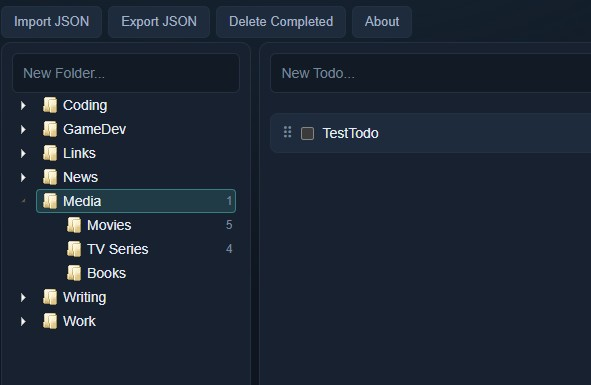

# TreeText

Tree-based todo and knowledge management app. Organize tasks in a hierarchical folder structure with a three-panel layout: folder tree on the left, todo list in the middle, and an edit/details panel on the right.

## Tech Stack

- **Backend:** Node.js, Express
- **Frontend:** jQuery, jsTree, Split.js, Bootstrap 3
- **Database:** PostgreSQL or SQLite (via `db/` abstraction layer, selected with `DB_CLIENT`)

## Features

- Hierarchical folder tree with lazy-loading, drag-and-drop, and context menu (rename/delete)
- Create, edit, and delete todos within folders
- Resizable three-panel split layout
- Dark theme
- Single `todos` table stores both folders and todo items, using a recursive CTE for tree queries
